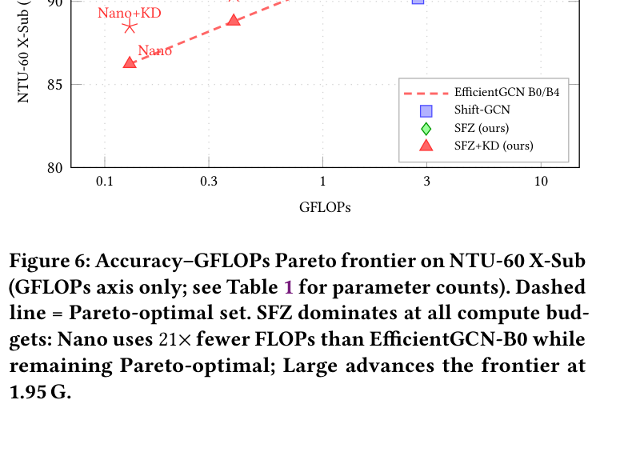
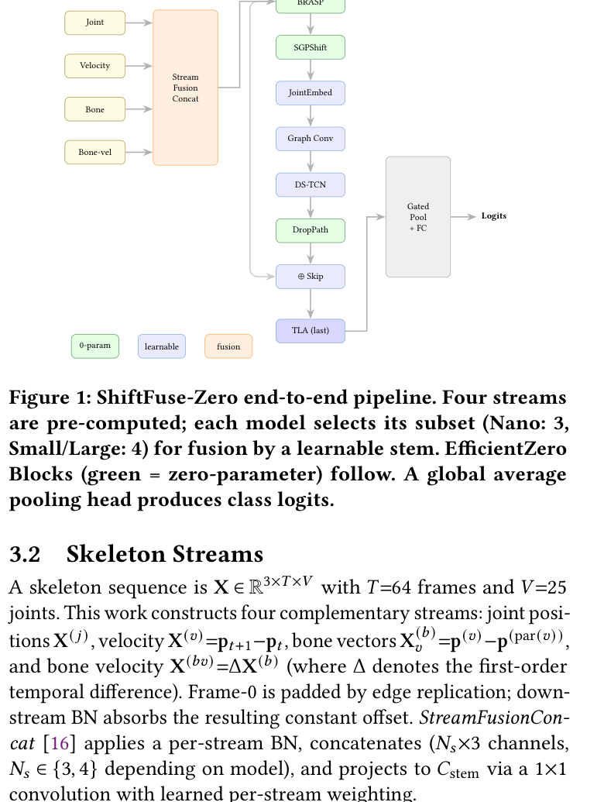
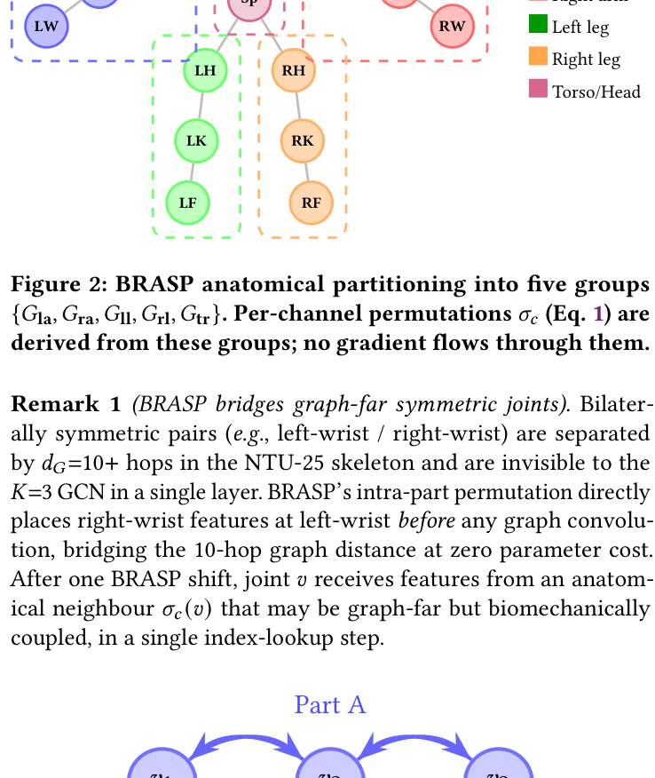
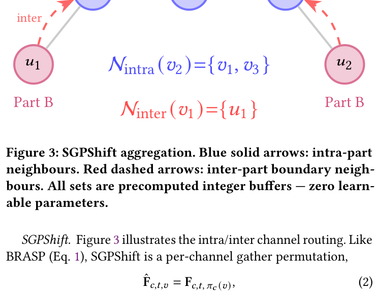
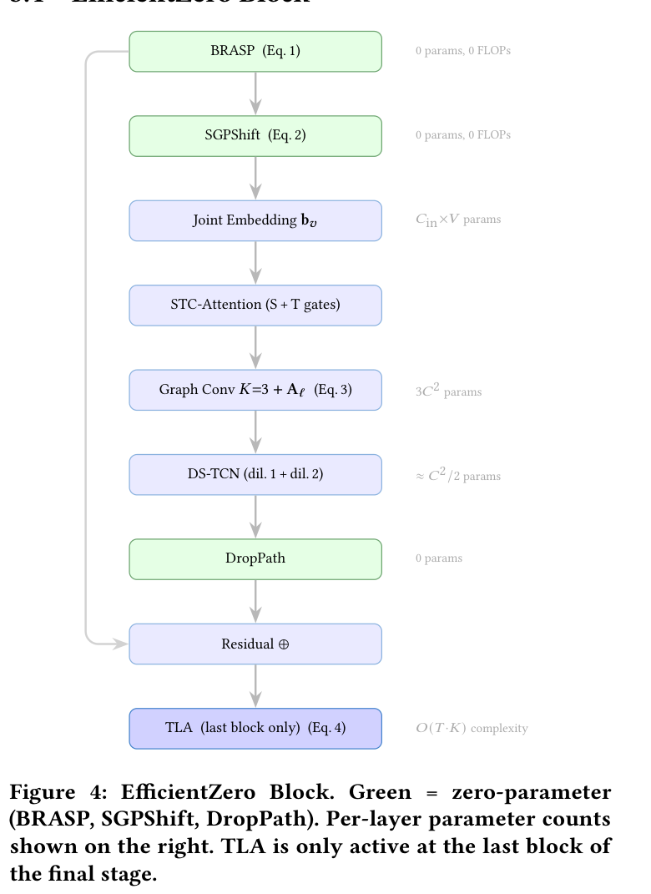
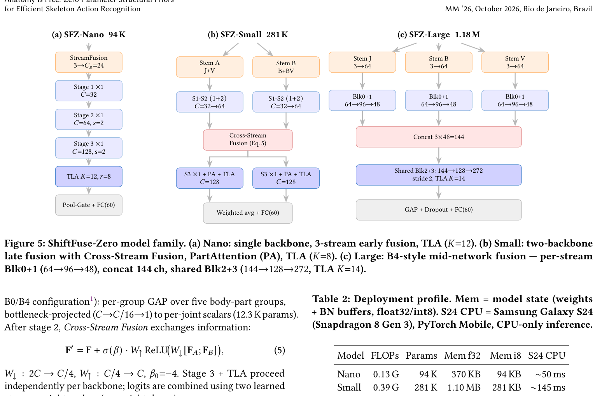
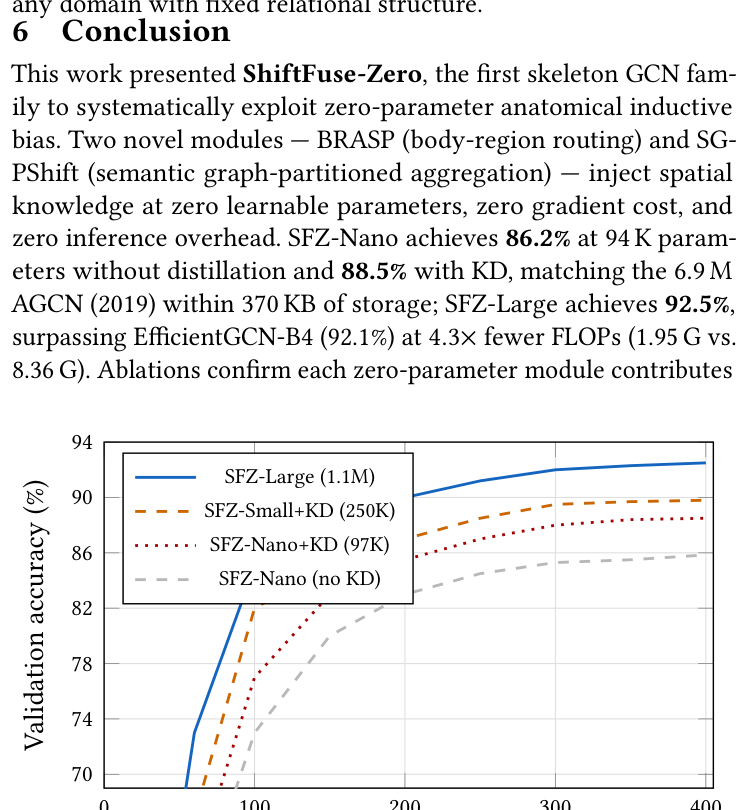

# Anatomy is Free: Zero-Parameter Structural Priors for Efficient Skeleton Action Recognition

**ShiftFuse-Zero (SFZ)** — ACM MM 2026 BNI Track

*Pathikreet Chowdhury, Anubhav Bhattacharya, Dr. Gargi Srivastava*

---

## Abstract

Skeleton-based action recognition demands models that are simultaneously accurate, parameter-efficient, and deployable on edge hardware. This work presents **ShiftFuse-Zero**, a family of three networks whose spatial inductive bias is introduced entirely without learnable parameters through two complementary zero-parameter modules: **BRASP** (Body-Region Anatomical Shift Priors), which routes joint features through anatomically meaningful channels via pure tensor indexing, and **SGPShift** (Semantic Graph-Partitioned Shift), which aggregates intra- and inter-part neighbours through pre-defined group indices at zero learnable parameter overhead.

Three models cover the edge-to-server spectrum: **Nano** (94 K), **Small** (281 K), and **Large** (1.18 M). On NTU RGB+D 60 X-Sub, results without distillation are 86.2% (Nano), 88.8% (Small), and 92.5% (Large). Knowledge distillation lifts Nano/Small to 88.5%/90.4%. SFZ-Nano dominates the accuracy–efficiency frontier among sub-100 K skeleton models, runs in **11 ms** on desktop CPU and **50 ms** on mobile (Snapdragon 8 Gen 3), and fits in **370 KB**.

---

## Results

### NTU RGB+D 60 & 120 — Comparison with State of the Art

| Method | Params | NTU-60 X-Sub | NTU-60 X-View | NTU-120 X-Sub | NTU-120 X-Set |
|--------|--------|:---:|:---:|:---:|:---:|
| ST-GCN | 3.1 M | 81.5 | 88.3 | 70.7 | 73.2 |
| AGCN | 6.9 M | 88.5 | 95.1 | 82.5 | 84.2 |
| MS-G3D | 6.4 M | 91.5 | 96.2 | 86.9 | 88.4 |
| CTR-GCN | 5.8 M | 92.4 | 96.8 | 88.9 | 90.6 |
| InfoGCN | 9.9 M | 93.0 | 97.1 | 89.8 | 91.2 |
| HD-GCN | 7.5 M | 93.4 | 97.5 | 90.1 | 91.5 |
| SkateFormer | 2.4 M | 92.5 | 96.7 | 88.6 | 90.5 |
| BlockGCN | 2.0 M | 92.1 | 96.3 | 87.8 | 89.7 |
| EfficientGCN-B0 | 0.29 M | 90.2 | 94.9 | 83.8 | 85.6 |
| EfficientGCN-B4 | 1.10 M | 92.1 | 96.1 | 88.3 | 89.9 |
| Shift-GCN | 2.76 M | 90.7 | 96.5 | 85.9 | 87.6 |
| SGN | 0.69 M | 89.0 | 94.5 | 79.2 | 81.5 |
| **SFZ-Nano** | **0.094 M** | **86.24** | **90.8** | **82.2** | **83.8** |
| **SFZ-Nano + KD** | **0.094 M** | **88.5** | **93.2** | **84.1** | **85.6** |
| **SFZ-Small** | **0.281 M** | **88.8** | **93.1** | **84.3** | **85.9** |
| **SFZ-Small + KD** | **0.281 M** | **90.4** | **94.7** | **86.0** | **87.4** |
| **SFZ-Large** | **1.18 M** | **92.5** | **96.4** | **88.5** | **90.1** |

### Efficiency & Deployment

| Model | Params | GFLOPs | Desktop (i7) | Throughput | Snapdragon 8 Gen 3 | Model (f32) | Model (int8) |
|-------|--------|:------:|:---:|:---:|:---:|:---:|:---:|
| EfficientGCN-B0 | 0.29 M | 2.73 | 28 ms | 36/s | — | — | — |
| EfficientGCN-B4 | 1.10 M | 8.36 | 87 ms | 11/s | — | — | — |
| **SFZ-Nano** | **0.094 M** | **0.13** | **11 ms** | **91/s** | **50 ms** | **370 KB** | **94 KB** |
| **SFZ-Nano + KD** | **0.094 M** | **0.13** | **11 ms** | **91/s** | **50 ms** | **370 KB** | **94 KB** |
| **SFZ-Small** | **0.281 M** | **0.39** | **25 ms** | **40/s** | **145 ms** | **1.10 MB** | **281 KB** |
| **SFZ-Small + KD** | **0.281 M** | **0.39** | **25 ms** | **40/s** | **145 ms** | **1.10 MB** | **281 KB** |
| **SFZ-Large** | **1.18 M** | **1.95** | **89 ms** | **11/s** | **515 ms** | **4.70 MB** | **1.18 MB** |



SFZ-Small uses **7× fewer FLOPs** than EfficientGCN-B0 (0.39 G vs. 2.73 G) while matching its accuracy with KD.
SFZ-Large uses **4.3× fewer FLOPs** than EfficientGCN-B4 (1.95 G vs. 8.36 G) while surpassing it by 0.4 pp.

---

## Architecture Overview



---

## Method

### Zero-Parameter Spatial Modules

#### BRASP — Body-Region Anatomical Shift Priors



BRASP assigns per-channel fixed gather permutations σ_c : V → V over five physical joint regions combined into four channel groups (arm, leg, torso, cross-body):

```
F̃(c,t,v) = F(c,t, σ_c(v))
```

Arm channels (25%) cycle within the combined {left ∪ right arm} set (12 joints), enabling direct bilateral feature exchange; leg (25%) within combined leg joints (8 joints); torso (12.5%); cross-body (37.5%) via graph-neighbour adjacency. All σ_c are precomputed integer buffers — **zero parameters, zero gradient**.

> **Why it works**: Bilaterally symmetric pairs (e.g. left-wrist / right-wrist) are separated by d_G = 10+ hops in the NTU-25 skeleton, invisible to a K=3 GCN. BRASP places right-wrist features at left-wrist before any graph convolution, bridging the 10-hop distance in a single index-lookup step.

#### SGPShift — Semantic Graph-Partitioned Shift



SGPShift routes each channel to a ranked neighbour from a precomputed graph partition:

```
F̂(c,t,v) = F(c,t, π_c(v))
```

Channels split into three equal groups (C/3 each): intra-part (shift to top-ranked same-part neighbour via A_intra), inter-part (shift to top-ranked cross-part boundary neighbour via A_inter), and identity (pass through). All routing indices are precomputed integer buffers — **zero learnable parameters**, unlike HD-GCN and SkateFormer which use learnable per-group parameters.

### EfficientZero Block (Nano / Small)



```
BRASP → SGPShift → JE → STC-Attention → GCN (K=3, A_ℓ) → DS-TCN → DropPath → Residual ⊕
[TLA — last block of last stage only]
```

| Component | Description | Params |
|-----------|-------------|--------|
| BRASP + SGPShift | Anatomical pre-structuring | 0 |
| JE (Joint Embedding) | Per-joint additive bias b ∈ ℝ^(C×V) | C·V |
| STC-Attention | Spatial (softmax over V) + temporal (avg+max, kernel 9) gates | ~18 |
| GCN (K=3) | Σ_k W_k · (A_k + \|A_ℓ\|) @ x, shared A_ℓ ∈ ℝ^(V×V) | 3C² + 625 |
| DS-TCN | Dual-dilation depthwise-separable TCN (dil 1+2, kernel 9, 17-frame RF) | ~C²/2 |
| DropPath | Stochastic depth | 0 |
| TLA | Temporal Landmark Attention, O(T·K) complexity | O(T·K) |

**Block ordering matters**: Placing BRASP and SGPShift *before* the GCN is essential — the GCN refines an already anatomy-structured representation. Moving them after the GCN costs **−1.9 pp** (see ablation).

### TLA — Temporal Landmark Attention

K learnable temporal anchor frames replace O(T²) self-attention with O(T·K):

```
τ_k = T · σ(α_k),    k = 1,...,K
m_t = Σ_k Bilin(F, τ_k) · softmax_k(⟨q_t, k_{τ_k}⟩)
F_out = F + σ(β) · m,    β₀ = −4
```

Anchor positions are continuous and gradient-trainable via bilinear interpolation.

### Fusion Strategies

| Fusion | Model | Description |
|--------|-------|-------------|
| Early | Nano | 3 streams (joint + bone + velocity) → StreamFusionConcat → single backbone |
| Late | Small | Backbone A (joint + velocity), Backbone B (bone) → CrossStreamFusion after stage 2 and stage 3 |
| Mid-network | Large | 3 per-stream stems → concat (144 ch) → shared backbone (B4-style) |

Fusion ablation on Large: early fusion 89.8%, late fusion 91.9%, **mid-network 92.5%**.

### Model Configurations



| Model | Stem | Channels | Blocks | TLA K | Drop-path | FLOPs | Params |
|-------|------|----------|--------|-------|-----------|-------|--------|
| Nano | 24 | [32, 64, 128] | [1, 1, 1] | 12 | 0.10 | 0.13 G | 94 K |
| Small | 24 | [32, 64, 128] | [1, 2, 1] | 8 | 0.10 | 0.39 G | 281 K |
| Large† | 64 | B4-style | — | 14 | 0.20 | 1.95 G | 1.18 M |

†Large: per-stream 64→96 (d=2) →48 (d=2), concat 144, shared 144→128 (d=3) →272 (d=3) + TLA.

---

## Ablations

### Cumulative Component Ablation (Nano, NTU-60 X-Sub)

| BRASP | SGPShift | TLA | KD | Acc (%) | Δ |
|:-----:|:--------:|:---:|:--:|:-------:|:---:|
| | | | | 82.8 | — |
| ✓ | | | | 83.9 | +1.1 |
| ✓ | ✓ | | | 84.6 | +1.8 |
| ✓ | ✓ | ✓ | | 86.24 | +3.44 |
| ✓ | ✓ | ✓ | ✓ | **88.5** | +5.7 |

BRASP+SGPShift also contribute +1.4 pp on Small (85.2% → 86.6%), confirming consistent gains at larger scale.

### Block Component Ablation (Nano, NTU-60 X-Sub)

| Configuration | Params | Acc (%) | Δ |
|---------------|--------|:-------:|:---:|
| Full EfficientZero Block | 94 K | 86.24 ±0.14 | — |
| BRASP/SGPShift placed after GCN | 94 K | 84.3 ±0.19 | −1.9 |
| Learned V×V routing instead of SGPShift | 94 K | 85.6 ±0.16 | −0.6 |
| − STC-Attention | 87 K | 85.1 ±0.17 | −1.1 |
| − Joint Embedding | 87 K | 85.2 ±0.18 | −1.0 |
| DS-TCN → standard TCN | 101 K | 84.9 ±0.20 | −1.3 |
| − DropPath (rate = 0) | 93 K | 85.0 ±0.21 | −1.2 |

### Drop-path Rate Sensitivity (NTU-60 X-Sub)

| p_d | Nano | Small | Large |
|:---:|:----:|:-----:|:-----:|
| 0.00 | 84.9 | 86.8 | 91.6 |
| 0.05 | 85.2 | 87.2 | 91.9 |
| **0.10** | **85.85** | **87.6** | 92.1 |
| 0.15 | 85.4 | 87.4 | 92.3 |
| 0.20 | 85.1 | 87.1 | **92.5** |
| 0.25 | 84.8 | 86.7 | 92.3 |

Full Nano with TLA enabled at p_d = 0.10 scores **86.24%**. Full Small with PartAttention at p_d = 0.10 scores **88.8%**.

---

## Training

### Commands

**Train Nano (300 epochs, SGD, cosine warmup):**
```bash
python scripts/train.py --model shiftfuse_zero_nano_tiny_efficient --dataset ntu60 --amp
```

**Train Small (300 epochs, SGD):**
```bash
python scripts/train.py --model shiftfuse_zero_small_late_efficient --dataset ntu60 --amp
```

**Train Large (100 epochs, SGD, batch 16):**
```bash
python scripts/train.py --model shiftfuse_zero_large_b4_efficient --dataset ntu60 --amp
```

**Knowledge Distillation — Nano from Large:**
```bash
python scripts/train.py \
  --model shiftfuse_zero_nano_tiny_efficient --dataset ntu60 --amp \
  --teacher_checkpoint /path/to/large_best.pth \
  --kd_weight 0.5 --kd_temp 4.0
```

**Knowledge Distillation — Small from Large:**
```bash
python scripts/train.py \
  --model shiftfuse_zero_small_late_efficient --dataset ntu60 --amp \
  --teacher_checkpoint /path/to/large_best.pth \
  --kd_weight 0.5 --kd_temp 4.0
```

### Training Hyperparameters

| | Nano | Small | Large |
|---|------|-------|-------|
| Optimizer | SGD | SGD | SGD |
| LR | 0.1 | 0.1 | 0.1 |
| Weight decay | 1e-4 | 1e-4 | 1e-4 |
| Scheduler | cosine + warmup(10) | cosine + warmup(10) | cosine + warmup(5) |
| Epochs | 300 | 300 | 100 |
| Batch size | 64 | 64 | 16 |
| Mixup α | 0.1 | 0.1 | 0.0 |
| Drop-path | 0.10 | 0.10 | 0.20 |
| Dropout | 0.10 | 0.10 | 0.25 |

KD loss: `(1 − α)·CrossEntropy + α·T²·KL(student ‖ teacher)`, α = 0.5, T = 4.0.



---

## Project Structure

```
LAST/
├── src/
│   ├── models/
│   │   ├── shiftfuse_zero.py           # Full model family (Nano → X)
│   │   ├── graph.py                    # Skeleton graph (K=3 semantic body-part partitions)
│   │   └── blocks/
│   │       ├── body_region_shift.py    # BRASP (0-param anatomical shift)
│   │       ├── sgp_shift.py            # SGPShift (0-param semantic aggregation)
│   │       ├── stc_attention.py        # STC-Attention (spatial + temporal gates)
│   │       ├── joint_embedding.py      # JE (per-joint identity bias)
│   │       ├── temporal_landmark_attn.py  # TLA (O(T·K) temporal anchors)
│   │       ├── part_attention.py       # PartAttention (5-group anatomy gating, Small+)
│   │       ├── dw_sep_tcn.py           # DS-TCN (dual-dilation depthwise-sep TCN)
│   │       ├── drop_path.py            # DropPath stochastic depth
│   │       ├── stream_fusion_concat.py # Multi-stream BN + concat stem
│   │       └── cross_stream_fusion.py  # CrossStreamFusion (late fusion gate)
│   ├── training/
│   │   └── trainer.py                  # Trainer (SGD/AdamW, KD, Mixup, TTA, AMP)
│   └── data/
│       ├── dataset.py                  # SkeletonDataset (joint / bone / velocity)
│       └── transforms.py              # TemporalCrop, spatial flip, augmentations
├── configs/
│   ├── model/                          # Per-variant model YAML configs
│   ├── training/                       # Per-variant training schedules
│   └── environment/                   # local / kaggle / gcp / a100 YAMLs
├── scripts/
│   └── train.py                        # Training entry point
└── tests/
    └── test_shiftfuse.py               # Model build + forward pass tests
```

---

## Limitations

BRASP/SGPShift assume 25-joint NTU skeletons; adaptation to 17-joint COCO or 133-joint whole-body requires redefining groups (format-agnostic, automatable from kinematic data). KD requires a pre-trained Large teacher; self-distillation would remove this dependency. Future work will study COCO-based transfer and body-part discovery for arbitrary topologies; zero-parameter routing priors generalise naturally to any domain with fixed relational structure (molecular graphs, traffic networks).

---

## Citation

```bibtex
@inproceedings{sfz2026,
  title     = {Anatomy is Free: Zero-Parameter Structural Priors for Efficient Skeleton Action Recognition},
  author    = {Chowdhury, Pathikreet and Bhattacharya, Anubhav and Srivastava, Gargi},
  booktitle = {Proceedings of the 34th ACM International Conference on Multimedia (BNI Track)},
  year      = {2026},
  location  = {Melbourne, Australia},
}
```
